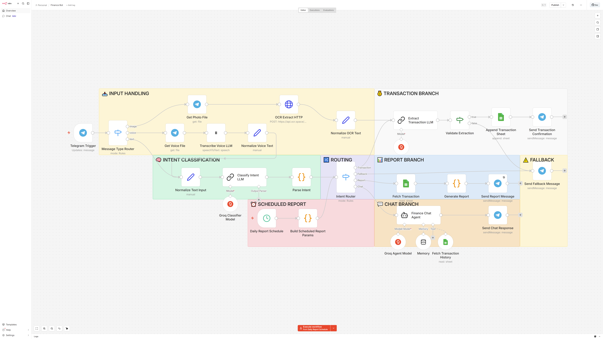

# 💸 FinBot — AI-Powered Personal Finance Assistant

> An intelligent Telegram bot that captures, organizes, and analyzes your personal finances in seconds using AI.



## 🎯 Why FinBot?

Traditional expense tracking is slow, repetitive, and easy to abandon. Most finance apps require multiple manual steps just to record a single transaction.

FinBot removes that friction.

Simply send a text message, receipt photo, or voice note through Telegram, and the AI automatically understands, categorizes, and stores your transaction—without opening another app.

## ✨ Key Features

- 💬 **Natural Language Input** — Log expenses like *"Lunch 45k"* or *"Salary 5 million"*.
- 📸 **Receipt Scanner** — Extract transaction data automatically using AI-powered OCR.
- 🎙️ **Voice Recognition** — Convert voice notes into structured financial records.
- 🤖 **AI Intent Detection** — Automatically understands whether you're recording a transaction, requesting a report, or asking financial questions.
- 📊 **Smart Reports** — Generate daily and weekly spending summaries.
- 💡 **AI Financial Chat** — Ask questions about your own spending habits and receive contextual answers.
- ⚡ **Fully Automated Workflow** — No manual categorization or data entry required.

## 🛠 Tech Stack

- **n8n** — Workflow Automation
- **Groq API** — Fast LLM for intent detection & transaction parsing
- **Gemini 2.0 Flash** — OCR & Voice Transcription
- **Google Sheets** — Database
- **Telegram Bot API** — User Interface

## 🏗 Workflow Architecture

> Every incoming message is normalized into a single data format before being processed by an AI-powered routing system.

```
Telegram
      │
      ▼
Normalize Input
(Text / Photo / Voice)
      │
      ▼
AI Intent Detection
      │
 ┌────┼────┬─────┐
 │    │    │     │
 ▼    ▼    ▼     ▼
Transaction Report Chat Fallback
```

*(Insert your n8n workflow screenshot here.)*

## 🚀 Getting Started

1. Clone this repository.
2. Import `workflow.json` into n8n.
3. Copy `.env.example` and configure your credentials.
4. Create a Google Sheet using the provided template.
5. Connect your Telegram Bot Token.
6. Activate the workflow.

## 📸 Demo

- 🎥 Demo Video
- 📷 Workflow Screenshot
- 📊 Example Reports

## 📚 What I Learned

Building FinBot taught me how to:

- Design scalable AI workflows using n8n.
- Combine multiple AI models based on their strengths.
- Process text, images, and voice through a unified automation pipeline.
- Build reliable intent-routing systems for conversational applications.

## 🔮 Future Improvements

- Monthly analytics dashboard
- Budget tracking
- Multi-currency support
- Spending notifications
- PostgreSQL support
- Multi-user authentication

## 📄 License

Licensed under the MIT License.
