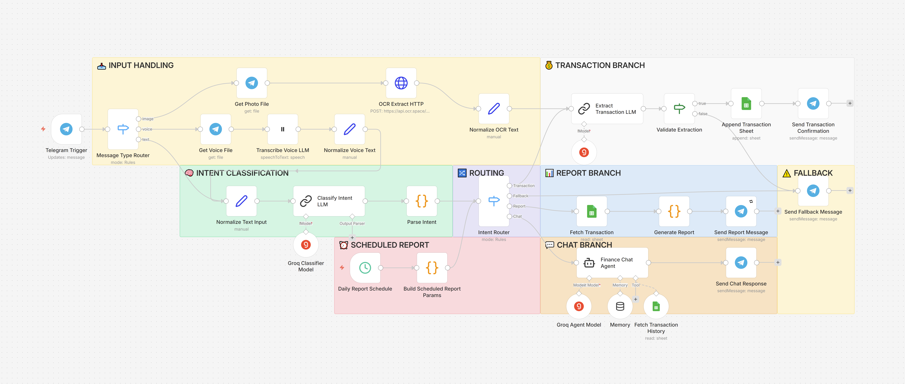

# 💸 FinBot — AI-Powered Personal Finance Assistant With n8n

> An intelligent Telegram bot that captures, organizes, and analyzes your personal finances in seconds using AI.


## 📋 Overview

Traditional expense tracking is slow, repetitive, and easy to abandon. Most finance apps require multiple manual steps just to record a single transaction.

FinBot removes that friction.

Simply send a text message, receipt photo, or voice note through Telegram, and the AI automatically understands, categorizes, and stores your transaction—without opening another app.

## 🌟 What Makes FinBot Different

Most finance bots only support today's date and offer rigid, one-size-fits-all reports. FinBot is built to handle how people actually think about their money:

**Log transactions for any date, not just today.**  
Say *"paid electricity bill yesterday"* or *"lunch on July 5th, 45k"* — the bot understands the time reference and records it under the correct date, not the date the message was sent.

**Ask for the report you actually want.**  
Beyond simple daily/weekly summaries, you can request reports by custom date range, filtered by category, or filtered by payment method — just by asking in plain language, no menus or filters to configure.

## ✨ Key Features

- 💬 **Natural Language Input** — Log income or expenses in plain conversational text, with flexible date recognition (today, yesterday, or a specific date).
- 📸 **Receipt Scanner** — Extract transaction data automatically using AI-powered OCR.
- 🎙️ **Voice Recognition** — Talk to the bot instead of typing — voice notes are transcribed and routed through the same AI pipeline as text, so you can log a transaction, ask for a report, or ask a financial question, all by voice.
- 🤖 **AI Intent Detection** — Automatically understands whether you're recording a transaction, requesting a report, or asking financial questions.
- 📊 **Flexible Reports** — Daily, weekly, monthly, custom-date and date range, or filtered by category and payment method.
- 💡 **AI Financial Chat** — Ask questions about your own spending habits and receive contextual answers.
- ⚡ **Fully Automated Workflow** — No manual categorization or data entry required.

## 🛠️ Tech Stack

- ⚙️ **n8n** — Orchestrates the entire automation workflow
- 🧠 **Groq API** — Intent detection, transaction parsing, and AI-powered conversations
- 📄 **OCR.Space API** — Converts receipt images into structured text using OCR
- 🎙️ **ElevenLabs API** — Transcribes voice notes into text with high accuracy
- 📊 **Google Sheets API** — Stores and manages financial data in real time
- 💬 **Telegram Bot API** — Provides a fast, intuitive chat interface for users
  
## 🏗 Workflow Architecture

> Every incoming message is normalized into a single data format before being processed by an AI-powered routing system.

```
  Telegram
        │
        ▼
Normalize Input
(Text / Photo / Voice)
        │
        ▼
AI Intent Detection
        │
   ┌────┼──────┬─────────┐
   │    │      │         │
   ▼    ▼      ▼         ▼
Report Chat Fallback Transaction
```



### How It Works

**📥 Input Handling**  
The bot accepts 3 input types — typed text, voice notes, and receipt 
photos. Each is normalized into a consistent `text` field before further 
processing.

**🧠 Intent Classification**  
Classifies the user's message into one of four intents — transaction, report, chat, or fallback — including period and filter detection for report queries.

**🔀 Routing**  
Routes to the matching branch based on the classified intent. Photo input skips this step entirely — receipts always go straight to the Transaction branch.

**💰 Transaction Branch**  
Extracts structured data (date, category, amount, payment method) via LLM, validates that it's not empty, then logs the entry to Google Sheets with an auto-calculated running balance.

**📊 Report Branch**  
Filters transactions by period (today/week/month/custom) and by category or payment method, then returns income, expenses, and running balance.

**💬 Chat Branch**  
An AI agent answers general finance questions and can pull transaction history from Sheets when the user asks about their own data.

**⏰ Scheduled Report**  
Sends a daily financial report automatically at 7 PM, using the same Report Branch logic as manual requests.

**⚠️ Fallback**  
Catches unclear messages and failed voice/photo extraction — guiding the user with example commands instead of leaving them stuck.

## 🚀 Getting Started

1. Clone this repository.
2. Import `workflow.json` into n8n.
3. Copy `.env.example` and configure your credentials.
4. Create a Google Sheet using the provided template.
5. Connect your Telegram Bot Token.
6. Activate the workflow.

## 📸 Demo

- 🎥 Demo Video
- 📷 Workflow Screenshot
- 📊 Example Reports

## 📚 What I Learned

Building FinBot taught me how to:

- **Design scalable AI workflows** using n8n's visual branching instead of hardcoded conditionals, making the system easier to debug and extend.
- **Combine multiple AI models based on their strengths** — routing latency-sensitive text tasks to Groq while reserving Gemini for multimodal inputs it handles natively.
- **Normalize diverse input types (text, voice, photos) into a consistent format** while still allowing different processing paths — e.g. receipts skip intent classification and go straight to transaction logging, since their intent is always unambiguous.
- **Build reliable intent-routing systems** for conversational apps, including handling misclassification on informal, mixed-language input through prompt engineering rather than more complex code.


## 🔮 Future Improvements

- Monthly analytics dashboard
- Budget tracking
- Multi-currency support
- Spending notifications
- PostgreSQL support
- Multi-user authentication

## 📄 License

Licensed under the MIT License.
